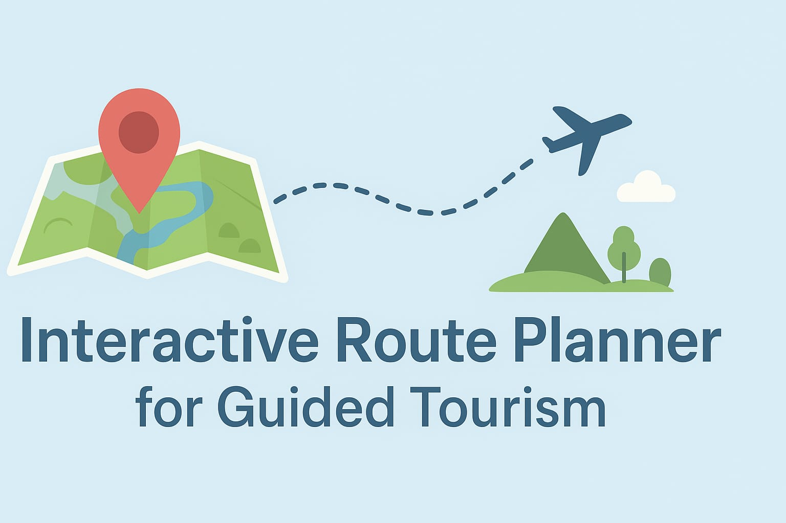

<p align="center">
  
</p>


# 🗺 Interactive Route Planner for Guided Tourism  

## 📌 Project Overview  
The *Interactive Route Planner for Guided Tourism* is a web-based application that helps travelers and tourists plan optimized routes for guided tours. It allows users to explore attractions, customize their journey, and get interactive maps for efficient navigation.  

---

## 🚀 Features  
- ✅ *User-Friendly Interface* – Easy-to-use route planning with an intuitive UI.  
- ✅ *Customizable Routes* – Add, remove, or reorder destinations.  
- ✅ *Optimized Path* – Suggests the shortest/most efficient route.  
- ✅ *Attraction Highlights* – Displays information about tourist spots.  
- ✅ *Responsive Design* – Works across desktop and mobile devices.  

---

## 🛠 Tools & Technologies  
- *Frontend:* HTML, CSS  
- *Backend:* Python  
- *Visualization:* Interactive Maps / Route Guides  

---

## 🎯 Purpose  
To provide tourists and travel enthusiasts with a *personalized guided experience*, saving time and enhancing exploration through smart route planning.  

---

## 👩‍💻 My Role  
- Designed the *frontend interface* using HTML & CSS.  
- Developed the *backend logic* in Python.   
- Implemented the *interactive route planner* feature.  

---
## 📂 Project Structure  
```bash
Interactive-Route-Planner/
│── index.html        # Main homepage
│── style.css         # Styling
│── app.py            # Backend logic
│── routes/           # Route planning logic
│── assets/           # Images, icons, etc.
│── README.md         # Documentation

